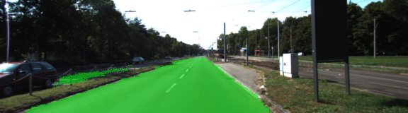
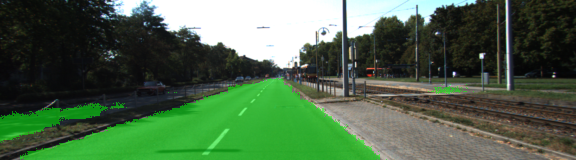
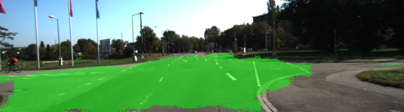
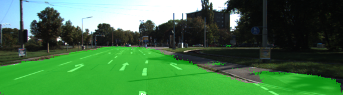

[//]: # (Image References)

[animated-output]: ./runs/1504658354.6969173/anim_road.gif

[image-um0]: ./data/um_000000.png
[image-um1]: ./data/um_000001.png
[image-umm0]: ./data/umm_000000.png
[image-umm1]: ./data/umm_000001.png
[image-uu0]: ./data/uu_000000.png
[image-uu1]: ./data/uu_000001.png

[gtimage-um0]: ./data/um_lane_000000.png
[gtimage-um1]: ./data/um_lane_000001.png
[gtimage-umm0]: ./data/umm_road_000000.png
[gtimage-umm1]: ./data/umm_road_000001.png
[gtimage-uu0]: ./data/uu_road_000000.png
[gtimage-uu1]: ./data/uu_road_000001.png

[result-image-um0]: ./runs/1504658354.6969173/um_000000.png
[result-image-um1]: ./runs/1504658354.6969173/um_000001.png
[result-image-umm0]: ./runs/1504658354.6969173/umm_000000.png
[result-image-umm1]: ./runs/1504658354.6969173/umm_000001.png
[result-image-uu0]: ./runs/1504658354.6969173/uu_000000.png
[result-image-uu1]: ./runs/1504658354.6969173/uu_000001.png

# Semantic Segmentation

### Introduction
In this project, you'll label the pixels of a road in images using a Fully Convolutional Network (FCN).

The goal of this project is to understand the concepts of Fully Convolutional Network (FCN) and write a program to label the pixels of a road in images.

The results of the run are present in the logsData file. The test images are in the `runs` folder.

Examples of the training images:

Original Camera Image   |  Ground truth generated by manual annotation  
:----------------------:|:--------------------------------------------:
![alt-text][image-um0]  | ![alt-text][gtimage-um0]  
![alt-text][image-um1]  | ![alt-text][gtimage-um1]  
![alt-text][image-umm0]  | ![alt-text][gtimage-umm0]  
![alt-text][image-umm1]  | ![alt-text][gtimage-umm1]  
![alt-text][image-uu0]  | ![alt-text][gtimage-uu0]  
![alt-text][image-uu1]  | ![alt-text][gtimage-uu1]  

---

### Architecture

A pre-trained VGG-16 network was converted to a fully convolutional network by converting the final fully connected layer to a 1x1 convolution and setting the depth equal to the number of desired classes (in this case, two: road and not-road). Performance is improved through the use of skip connections, performing 1x1 convolutions on previous VGG layers (in this case, layers 3 and 4) and adding them element-wise to upsampled (through transposed convolution) lower-level layers (i.e. the 1x1-convolved layer 7 is upsampled before being added to the 1x1-convolved layer 4). Each convolution and transpose convolution layer includes a kernel initializer and regularizer

---

### Optimizer

The loss function for the network is cross-entropy, and an Adam optimizer is used.

---

### Training

The hyperparameters used for training are:

  - keep_prob: 0.5
  - learning_rate: 0.0009
  - epochs: 25
  - batch_size: 16

---

### Train Results

- Epoch: 0/25 | Execution Time: 19.111719 sec | Loss: 0.5272083282470703
- Epoch: 1/25 | Execution Time: 35.192439 sec | Loss: 0.2041412889957428
- Epoch: 2/25 | Execution Time: 51.362913 sec | Loss: 0.16918902099132538
- Epoch: 3/25 | Execution Time: 67.358598 sec | Loss: 0.19845721125602722
- Epoch: 4/25 | Execution Time: 83.408402 sec | Loss: 0.14211736619472504
- Epoch: 5/25 | Execution Time: 99.636254 sec | Loss: 0.16290423274040222
- Epoch: 6/25 | Execution Time: 115.70175099999999 sec | Loss: 0.1123085767030716
- Epoch: 7/25 | Execution Time: 131.741223 sec | Loss: 0.5022396445274353
- Epoch: 8/25 | Execution Time: 147.769128 sec | Loss: 0.13068705797195435
- Epoch: 9/25 | Execution Time: 163.813714 sec | Loss: 0.11155102401971817
- Epoch: 10/25 | Execution Time: 179.83248799999998 sec | Loss: 0.08798660337924957
- Epoch: 11/25 | Execution Time: 195.88330399999998 sec | Loss: 0.15328627824783325
- Epoch: 12/25 | Execution Time: 211.923601 sec | Loss: 0.05937640368938446
- Epoch: 13/25 | Execution Time: 227.927481 sec | Loss: 0.0824950635433197
- Epoch: 14/25 | Execution Time: 243.924142 sec | Loss: 0.07202279567718506
- Epoch: 15/25 | Execution Time: 259.94838 sec | Loss: 0.05812866985797882
- Epoch: 16/25 | Execution Time: 275.939361 sec | Loss: 0.06622869521379471
- Epoch: 17/25 | Execution Time: 291.978812 sec | Loss: 0.13202236592769623
- Epoch: 18/25 | Execution Time: 308.036312 sec | Loss: 0.09400054067373276
- Epoch: 19/25 | Execution Time: 324.012979 sec | Loss: 0.03189713507890701
- Epoch: 20/25 | Execution Time: 340.00436 sec | Loss: 0.06519308686256409
- Epoch: 21/25 | Execution Time: 355.966684 sec | Loss: 0.021495511755347252
- Epoch: 22/25 | Execution Time: 371.971759 sec | Loss: 0.03929092362523079
- Epoch: 23/25 | Execution Time: 387.93568899999997 sec | Loss: 0.032834939658641815
- Epoch: 24/25 | Execution Time: 403.961944 sec | Loss: 0.06721004098653793

### Test Results 

Below are a few sample images from the output of the fully convolutional network, with the segmentation class overlaid upon the original image in green.







---

### Setup
##### Frameworks and Packages
Make sure you have the following is installed:
`conda env create -f environment.yaml`

 - [Python 3.5](https://www.python.org/)
 - [TensorFlow-gpu 1.0.0](https://www.tensorflow.org/)
 - [NumPy 1.13.1](http://www.numpy.org/)
 - [SciPy 0.17.0](https://www.scipy.org/)
 - Pillow 4.2.1
 - tqdm 4.15.0
##### Dataset
Download the [Kitti Road dataset](http://www.cvlibs.net/datasets/kitti/eval_road.php) from [here](http://www.cvlibs.net/download.php?file=data_road.zip).  Extract the dataset in the `data` folder.  This will create the folder `data_road` with all the training a test images.

### Start
##### Implement
Implement the code in the `main.py` module indicated by the "TODO" comments.
The comments indicated with "OPTIONAL" tag are not required to complete.
##### Run
Run the following command to run the project:
```
python main.py
```
**Note** If running this in Jupyter Notebook system messages, such as those regarding test status, may appear in the terminal rather than the notebook.

### Submission
1. Ensure you've passed all the unit tests.
2. Ensure you pass all points on [the rubric](https://review.udacity.com/#!/rubrics/989/view).
3. Submit the following in a zip file.
 - `helper.py`
 - `main.py`
 - `project_tests.py`
 - Newest inference images from `runs` folder
 
 ## How to write a README
A well written README file can enhance your project and portfolio.  Develop your abilities to create professional README files by completing [this free course](https://www.udacity.com/course/writing-readmes--ud777).
