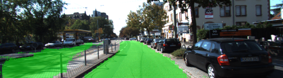
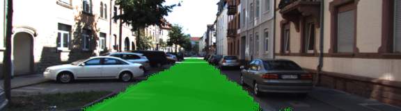

[//]: # (Image References)

[animated-output]: ./runs/1504658354.6969173/anim_road.gif

[image-um0]: ./data/um_000000.png
[image-um1]: ./data/um_000001.png
[image-umm0]: ./data/umm_000000.png
[image-umm1]: ./data/umm_000001.png
[image-uu0]: ./data/uu_000000.png
[image-uu1]: ./data/uu_000001.png

[gtimage-um0]: ./data/um_lane_000000.png
[gtimage-um1]: ./data/um_lane_000001.png
[gtimage-umm0]: ./data/umm_road_000000.png
[gtimage-umm1]: ./data/umm_road_000001.png
[gtimage-uu0]: ./data/uu_road_000000.png
[gtimage-uu1]: ./data/uu_road_000001.png

[result-image-um0]: ./runs/1504658354.6969173/um_000000.png
[result-image-um1]: ./runs/1504658354.6969173/um_000001.png
[result-image-umm0]: ./runs/1504658354.6969173/umm_000000.png
[result-image-umm1]: ./runs/1504658354.6969173/umm_000001.png
[result-image-uu0]: ./runs/1504658354.6969173/uu_000000.png
[result-image-uu1]: ./runs/1504658354.6969173/uu_000001.png

# Semantic Segmentation

### Introduction
In this project, you'll label the pixels of a road in images using a Fully Convolutional Network (FCN).

The goal of this project is to understand the concepts of Fully Convolutional Network (FCN) and write a program to label the pixels of a road in images.

The results of the run are present in the logsData file. The test images are in the `runs` folder.

Examples of the training images:

Original Camera Image   |  Ground truth generated by manual annotation  
:----------------------:|:--------------------------------------------:
![alt-text][image-um0]  | ![alt-text][gtimage-um0]  
![alt-text][image-um1]  | ![alt-text][gtimage-um1]  
![alt-text][image-umm0]  | ![alt-text][gtimage-umm0]  
![alt-text][image-umm1]  | ![alt-text][gtimage-umm1]  
![alt-text][image-uu0]  | ![alt-text][gtimage-uu0]  
![alt-text][image-uu1]  | ![alt-text][gtimage-uu1]  

---

### Results 

Below are a few sample images from the output of the fully convolutional network, with the segmentation class overlaid upon the original image in green.





---

### Setup
##### Frameworks and Packages
Make sure you have the following is installed:
`conda env create -f environment.yaml`

 - [Python 3.5](https://www.python.org/)
 - [TensorFlow-gpu 1.0.0](https://www.tensorflow.org/)
 - [NumPy 1.13.1](http://www.numpy.org/)
 - [SciPy 0.17.0](https://www.scipy.org/)
 - Pillow 4.2.1
 - tqdm 4.15.0
##### Dataset
Download the [Kitti Road dataset](http://www.cvlibs.net/datasets/kitti/eval_road.php) from [here](http://www.cvlibs.net/download.php?file=data_road.zip).  Extract the dataset in the `data` folder.  This will create the folder `data_road` with all the training a test images.

### Start
##### Implement
Implement the code in the `main.py` module indicated by the "TODO" comments.
The comments indicated with "OPTIONAL" tag are not required to complete.
##### Run
Run the following command to run the project:
```
python main.py
```
**Note** If running this in Jupyter Notebook system messages, such as those regarding test status, may appear in the terminal rather than the notebook.

### Submission
1. Ensure you've passed all the unit tests.
2. Ensure you pass all points on [the rubric](https://review.udacity.com/#!/rubrics/989/view).
3. Submit the following in a zip file.
 - `helper.py`
 - `main.py`
 - `project_tests.py`
 - Newest inference images from `runs` folder
 
 ## How to write a README
A well written README file can enhance your project and portfolio.  Develop your abilities to create professional README files by completing [this free course](https://www.udacity.com/course/writing-readmes--ud777).
